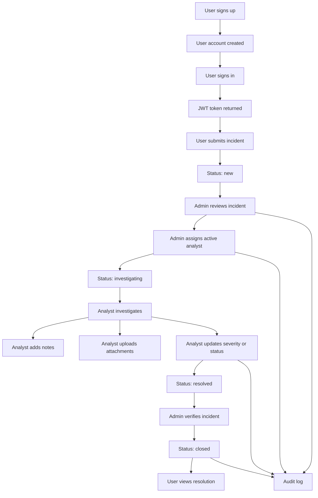
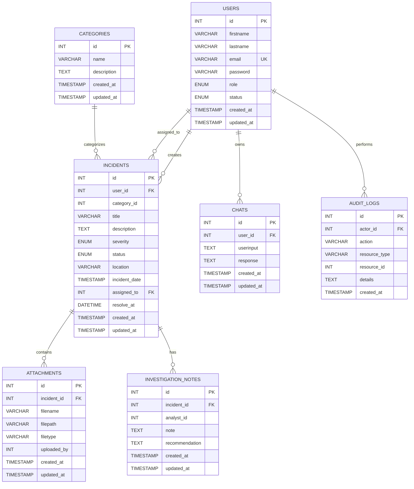

# CIMS API

Incident management system built with FastAPI and MySQL.

## Start the API

Activate the virtual environment:

```bash
source .venv/bin/activate
```

Run the database migration:

```bash
python core/database/migration/migration.py
```

Start the API:

```bash
uvicorn main:app --reload
```

Open the interactive API documentation:

- Swagger UI: http://localhost:8000/docs
- ReDoc: http://localhost:8000/redoc

Set a reusable API variable:

```bash
export API=http://localhost:8000
```

## System Workflow



## Roles

| Operation | Admin | Analyst | User |
|---|---:|---:|---:|
| View all incidents | Yes | No | No |
| View assigned incidents | Yes | Yes | No |
| View own incidents | Yes | Yes | Yes |
| Create incidents | Yes | Yes | Yes |
| Assign analysts | Yes | No | No |
| Change incident status | Yes | Yes | No |
| Close incidents | Yes | No | No |
| Manage categories | Yes | No | No |
| Add investigation notes | Yes | Yes | No |
| Upload attachments | Yes | Yes | No |
| Delete records | Yes | No | No |
| Manage users and roles | Yes | No | No |
| View audit logs | Yes | No | No |

Protected requests require:

```http
Authorization: Bearer YOUR_ACCESS_TOKEN
```

## Entity Relationship Diagram



`category_id`, `uploaded_by`, and `analyst_id` are currently logical relationships without explicit foreign-key constraints.

## Authentication

### Sign up

Public signup always creates a regular `user`.

```bash
curl -X POST "$API/auth/signup" \
  -H "Content-Type: application/json" \
  -d '{
    "email": "user@example.com",
    "firstname": "John",
    "lastname": "User",
    "password": "password123"
  }'
```

### Sign in

```bash
curl -X POST "$API/auth/signin" \
  -H "Content-Type: application/json" \
  -d '{
    "email": "user@example.com",
    "password": "password123"
  }'
```

Save the returned token:

```bash
export TOKEN="PASTE_ACCESS_TOKEN_HERE"
export ADMIN_TOKEN="PASTE_ADMIN_ACCESS_TOKEN_HERE"
```

## Categories

```bash
# List categories
curl "$API/categories" -H "Authorization: Bearer $TOKEN"

# Get category
curl "$API/categories/1" -H "Authorization: Bearer $TOKEN"

# Create category (admin)
curl -X POST "$API/categories" \
  -H "Authorization: Bearer $ADMIN_TOKEN" \
  -H "Content-Type: application/json" \
  -d '{"name":"Hardware","description":"Hardware-related incidents"}'

# Update category (admin)
curl -X PUT "$API/categories/1" \
  -H "Authorization: Bearer $ADMIN_TOKEN" \
  -H "Content-Type: application/json" \
  -d '{"name":"Network Hardware","description":"Routers and switches"}'

# Delete category (admin)
curl -X DELETE "$API/categories/1" \
  -H "Authorization: Bearer $ADMIN_TOKEN"
```

## Incidents

The authenticated user becomes the owner. The server controls `user_id` and initial assignment.

```bash
# Create incident
curl -X POST "$API/incidents" \
  -H "Authorization: Bearer $TOKEN" \
  -H "Content-Type: application/json" \
  -d '{
    "category_id": 1,
    "title": "Laptop cannot connect to Wi-Fi",
    "description": "The laptop cannot connect to the office wireless network.",
    "severity": "medium",
    "status": "new",
    "location": "Main office",
    "incident_date": "2026-09-14T10:00:00",
    "resolve_at": null
  }'

# List incidents
curl "$API/incidents" -H "Authorization: Bearer $TOKEN"

# Get incident
curl "$API/incidents/1" -H "Authorization: Bearer $TOKEN"

# Update incident
curl -X PUT "$API/incidents/1" \
  -H "Authorization: Bearer $TOKEN" \
  -H "Content-Type: application/json" \
  -d '{
    "category_id": 1,
    "title": "Laptop Wi-Fi issue",
    "description": "The wireless adapter is failing intermittently.",
    "severity": "high",
    "status": "investigating",
    "location": "Main office",
    "incident_date": "2026-09-14T10:00:00",
    "assigned_to": 2,
    "resolve_at": null
  }'

# Delete incident (admin)
curl -X DELETE "$API/incidents/1" \
  -H "Authorization: Bearer $ADMIN_TOKEN"
```

Valid statuses: `new`, `investigating`, `resolved`, `closed`.

Valid severities: `low`, `medium`, `high`, `critical`.

## Chats

```bash
# Send a message to the AI assistant
curl -X POST "$API/chats" \
  -H "Authorization: Bearer $TOKEN" \
  -H "Content-Type: application/json" \
  -d '{"message":"What is my incident status?"}'

# List chats
curl "$API/chats" -H "Authorization: Bearer $TOKEN"

# Get chat
curl "$API/chats/1" -H "Authorization: Bearer $TOKEN"

# Send a new message for an existing chat record
curl -X PUT "$API/chats/1" \
  -H "Authorization: Bearer $TOKEN" \
  -H "Content-Type: application/json" \
  -d '{"message":"What is the latest update?"}'

# Delete chat (admin)
curl -X DELETE "$API/chats/1" -H "Authorization: Bearer $ADMIN_TOKEN"
```

The service derives chat ownership from the authenticated user and generates `response` through Groq. Clients must not submit the assistant response.

## Attachments

```bash
# Create attachment record (admin or analyst)
curl -X POST "$API/attachments" \
  -H "Authorization: Bearer $TOKEN" \
  -H "Content-Type: application/json" \
  -d '{"incident_id":1,"filename":"error-log.txt","filepath":"/uploads/error-log.txt","filetype":"text/plain"}'

# List attachments
curl "$API/attachments" -H "Authorization: Bearer $TOKEN"

# Get attachment
curl "$API/attachments/1" -H "Authorization: Bearer $TOKEN"

# Update attachment (admin or analyst)
curl -X PUT "$API/attachments/1" \
  -H "Authorization: Bearer $TOKEN" \
  -H "Content-Type: application/json" \
  -d '{"incident_id":1,"filename":"updated-log.txt","filepath":"/uploads/updated-log.txt","filetype":"text/plain"}'

# Delete attachment (admin)
curl -X DELETE "$API/attachments/1" -H "Authorization: Bearer $ADMIN_TOKEN"
```

`uploaded_by` is derived from the authenticated user. This API stores attachment metadata and paths; it does not upload file bytes.

## Investigation Notes

```bash
# Create note (admin or assigned analyst)
curl -X POST "$API/investigation-notes" \
  -H "Authorization: Bearer $TOKEN" \
  -H "Content-Type: application/json" \
  -d '{"incident_id":1,"note":"The wireless driver is outdated.","recommendation":"Update the driver and restart the device."}'

# List notes
curl "$API/investigation-notes" -H "Authorization: Bearer $TOKEN"

# Get note
curl "$API/investigation-notes/1" -H "Authorization: Bearer $TOKEN"

# Update note (admin or assigned analyst)
curl -X PUT "$API/investigation-notes/1" \
  -H "Authorization: Bearer $TOKEN" \
  -H "Content-Type: application/json" \
  -d '{"incident_id":1,"note":"The driver was updated successfully.","recommendation":"Monitor the device for 24 hours."}'

# Delete note (admin)
curl -X DELETE "$API/investigation-notes/1" -H "Authorization: Bearer $ADMIN_TOKEN"
```

`analyst_id` is derived from the authenticated user.

## User Administration

All user-management endpoints are admin-only.

```bash
# List users
curl "$API/users" -H "Authorization: Bearer $ADMIN_TOKEN"

# Create analyst
curl -X POST "$API/users" \
  -H "Authorization: Bearer $ADMIN_TOKEN" \
  -H "Content-Type: application/json" \
  -d '{"email":"analyst@example.com","firstname":"Jane","lastname":"Analyst","password":"password123","role":"analyst","status":"active"}'

# Create admin
curl -X POST "$API/users" \
  -H "Authorization: Bearer $ADMIN_TOKEN" \
  -H "Content-Type: application/json" \
  -d '{"email":"admin@example.com","firstname":"System","lastname":"Admin","password":"password123","role":"admin","status":"active"}'

# Get user
curl "$API/users/2" -H "Authorization: Bearer $ADMIN_TOKEN"

# Update role or status
curl -X PUT "$API/users/2" \
  -H "Authorization: Bearer $ADMIN_TOKEN" \
  -H "Content-Type: application/json" \
  -d '{"email":"analyst@example.com","firstname":"Jane","lastname":"Analyst","role":"analyst","status":"inactive"}'
```

The last active administrator cannot be disabled or demoted.

## Audit Logs

Audit logs are admin-only:

```bash
curl "$API/audit-logs" -H "Authorization: Bearer $ADMIN_TOKEN"
```

Audit records contain the actor, action, resource type, resource ID, details, and timestamp.

## Route Summary

| Method | Endpoint | Access |
|---|---|---|
| POST | `/auth/signup` | Public |
| POST | `/auth/signin` | Public |
| GET | `/categories` | Authenticated |
| POST, PUT, DELETE | `/categories` and `/categories/{id}` | Admin |
| GET, POST, PUT | `/incidents` and `/incidents/{id}` | Authenticated |
| DELETE | `/incidents/{id}` | Admin |
| GET, POST, PUT | `/chats` and `/chats/{id}` | Authenticated |
| DELETE | `/chats/{id}` | Admin |
| GET | `/attachments` and `/attachments/{id}` | Authenticated |
| POST, PUT | `/attachments` and `/attachments/{id}` | Admin or analyst |
| DELETE | `/attachments/{id}` | Admin |
| GET | `/investigation-notes` and `/investigation-notes/{id}` | Authenticated |
| POST, PUT | `/investigation-notes` and `/investigation-notes/{id}` | Admin or assigned analyst |
| DELETE | `/investigation-notes/{id}` | Admin |
| GET, POST | `/users` | Admin |
| GET, PUT | `/users/{id}` | Admin |
| GET | `/audit-logs` | Admin |
